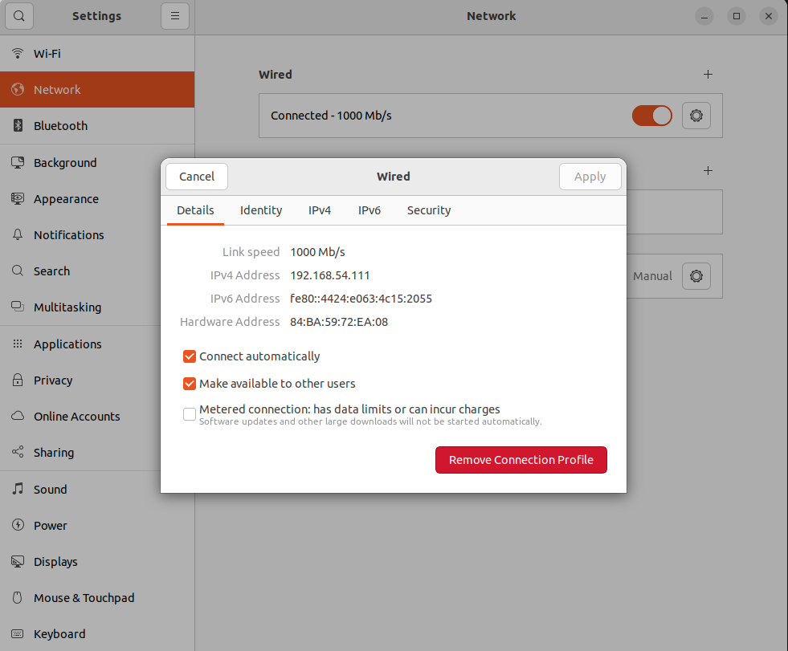

# 系统环境介绍

## 系统环境
推荐在ubuntu22.04系统下开发，暂不支持Mac/Windows系统下开发，机器人本体PC运行官方服务，不支持开发；

### 开发环境要求
- GCC ≥ 11.4 (for Linux)
- CMake ≥ 3.16
- Make build system
- C++20 (minimum)

### 第三方库依赖
```
sudo apt install protobuf-compiler libprotobuf-dev libprotoc-dev libgrpc++-dev libgrpc-dev libfmt-dev libspdlog-dev libcap-dev libacl1-dev liblcm-dev libyaml-cpp-dev libdw-dev libsystemd-dev -y
```

## 网络环境
将用户计算机与机器人交换机接入统一网络。建议新用户使用网线将用户计算机接入机器人交换机，并将与机器人通信的网卡设置在192.168.54.X网段下，推荐使用192.168.54.111。有经验的用户可自行配置网络环境。

假设SDK二次开发PC与机器人链接的网口为`eth0`，需要进行如下配置以便SDK与机器人的底层通信：

```bash
 sudo route add -net 224.0.0.0 netmask 240.0.0.0 dev eth0
```

### 配置步骤
1. 用网线的一端连接机器人，另一端连接用户电脑。机器人机载电脑的IP地址为192.168.54.110（小脑算力板）和192.168.54.119（大脑算力板），所以需要将电脑ip设置为同一网段，建议192.168.54.111.



2. 为了测试通信连接是否正常，可以通过ping进行测试：

